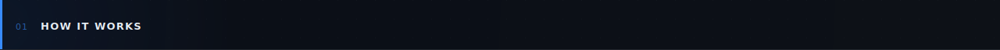
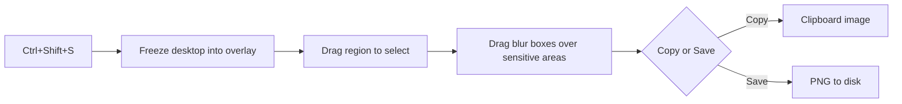
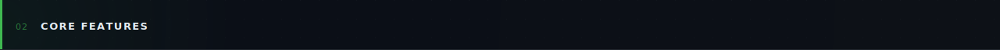
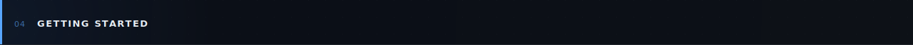

<div align="center">
  
</div>

<div align="center">


</div>

<br/>

Screenshot tools either dump a flat, full-monitor capture that leaks whatever else is on screen, or force you into an editor to redact it after the fact. Snap runs as a background hotkey listener — `Ctrl+Shift+S` freezes the desktop into a selectable overlay, lets you drag one or more blur boxes over anything sensitive, and copies or saves the composited result in the same motion.

<br/>





<br/>



- **Global hotkey capture** — `Ctrl+Shift+S` freezes the full virtual desktop from anywhere, no matter which app has focus
- **Freeform region select** — drag a rectangle across any monitor and redraw it as many times as needed before locking it in
- **Selective blur** — drop one or more blur boxes over anything to redact, each with an independently adjustable radius
- **Copy or save** — send the composited image straight to the clipboard, or write it to disk as a timestamped PNG
- **Tray-first design** — runs with no visible main window; New Capture and Settings are always one click away in the tray
- **Configurable save folder** — defaults to `Documents\screen`, with an option to auto-copy the saved file's path to the clipboard

<br/>


| Technology | Purpose |
|---|---|
| .NET 8 + WPF | Desktop UI framework |
| Hardcodet.NotifyIcon.Wpf | System tray icon — WPF has no built-in support |
| System.Drawing (GDI) | Screen capture and blur compositing |
| Win32 `RegisterHotKey` (P/Invoke) | Global hotkey registration on a hidden message-only window |

<br/>



```bash
# 1. Clone
git clone https://github.com/psilde/snap.git
cd snap

# 2. Run
dotnet run --project src/Snap
```

Settings are persisted as JSON at `%AppData%\ScreenBlur\settings.json`, created
automatically on first run with sensible defaults.

To publish a self-contained single-file `.exe`:

```bash
dotnet publish src/Snap -c Release -r win-x64
```
